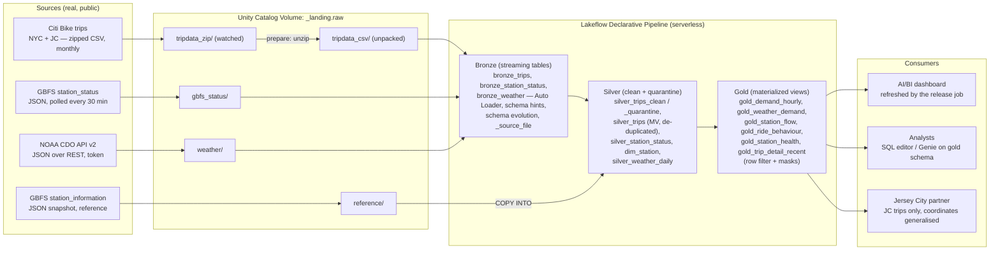

# Assignment 2C — Bike-Share Fleet Operations: Demand, Rebalancing & Station Health

Individual submission for BJIT Databricks Data Engineer Assignment 2C (Variant C).
Client (fictional): **Riverline Urban Planning**, advising a city transport department on
bike-share rebalancing and station expansion.

Status: work in progress, built incrementally Day 1 → Day 5 per the assignment's day plan.
This README is updated as each task is completed; nothing below is written ahead of being verified.

---

## 1. Project overview

Build a production-shaped Databricks lakehouse on ~55M real Citi Bike trip records (New York City +
Jersey City, May 2024 – June 2025), a live GBFS station-status feed, and NOAA daily weather, so the
client can answer: when demand peaks, which stations drain/fill, how e-bike usage is changing, how
weather affects demand, and which busy stations run empty. The platform must refresh itself as new
monthly files arrive, reconcile every file back to its source, quarantine (not silently drop) bad
records, and enforce that the Jersey City partner only sees Jersey City trips with generalised
coordinates. Everything is deployed from Git via one Databricks Asset Bundle to `dev` and `prod`.

## 2. Business problem

Citi Bike NYC set a ridership record in 2024 (44M+ rides) and its live feed reports bike/dock
availability every few minutes. Riverline's client (the city transport department) needs to know
where bikes pile up and where stations run dry, so they can plan rebalancing routes and station
expansion — but they also need to trust the numbers (every count reconciled), trust the access
model (partner data isolation, coordinate privacy), and be able to operate/deploy the platform
themselves after the engineer leaves.

## 3. Architecture

### 3.1 End-to-end lakehouse flow (assignment Section 2, "What you are building")



### 3.2 Landing simulator flow — where files actually get downloaded

Bronze never talks to S3 directly; it only watches the Unity Catalog Volume. The local relay script
(`tools/drop_files.py`, Appendix A.7) is what moves files from the public source into that Volume,
one batch at a time, to simulate a real upstream system:

```mermaid
flowchart LR
    S3["Public AWS S3 bucket\ns3.amazonaws.com/tripdata\n(no account/credentials needed)"]
    CACHE["Local cache\n.landing_cache/\n(this machine — download once)"]
    SDK["Databricks SDK upload\n(WorkspaceClient.files.upload)"]
    VOL["Unity Catalog Volume\n/Volumes/workspace/<env>_landing/raw/tripdata_zip/"]
    PREP["prepare.py (job task)\nunzip -> tripdata_csv/, register in ops.file_manifest"]
    BRZ["Bronze: bronze_trips\n(Auto Loader watches tripdata_csv/)"]

    S3 -->|"--download-only"| CACHE
    CACHE -->|"--env dev/prd --match/--batch/--interval"| SDK
    SDK --> VOL
    VOL --> PREP
    PREP --> BRZ
```



Why local, not direct-to-Bronze (decision recorded during Task 1.1 setup):
- **Simulates a real upstream system**: `--batch`/`--interval` deliver files over time so the
  file-arrival trigger, incremental Auto Loader behaviour, and per-period reconciliation are
  genuinely exercised (not a single bulk load).
- **Bronze reads CSVs, not zips**: `prepare.py` must unzip and register files in the manifest first;
  skipping that step bypasses required reconciliation bookkeeping.
- **Compute-quota conservation**: Free Edition has a daily compute quota; downloading ~10GB from a
  paid-by-the-second serverless notebook would spend quota on file transfer rather than pipeline
  work. The local relay is unmetered.
- **Explicit in the assignment**: `tools/drop_files.py` (Appendix A.7) is designed to run "on your
  laptop" — not invented for this session.

### 3.3 Unity Catalog layout (assignment Section 2)

| Schema (per target `<env>` = `dev`/`prd`) | Contents |
|---|---|
| `<env>_landing` | Volume `raw`: `tripdata_zip/`, `tripdata_csv/`, `gbfs_status/`, `reference/`, `weather/` |
| `<env>_lakehouse` | Pipeline-owned: `bronze_trips`, `bronze_station_status`, `bronze_weather`, `silver_trips_clean`/`_quarantine`, `silver_trips` (MV), `silver_station_status`, `silver_weather_daily` (MV), `dim_station` (MV), `ref_station_information` |
| `<env>_gold` | `gold_demand_hourly`, `gold_weather_demand`, `gold_station_flow`, `gold_ride_behaviour`, `gold_station_health`, `gold_trip_detail_recent` (row filter + masks) — the only schema analysts are granted |
| `<env>_ops` | `file_manifest`, `reconciliation`, `release`, `incidents`, `entitlements`; functions `rf_scope`, `mask_text`, `mask_coord`; performance-lab tables |

Nothing in deployed code is hard-coded to `dev`/`prd` — catalog and prefix come from bundle
variables, job parameters, or pipeline configuration.

## 4. Day-by-day plan

| Day | Focus | Exam sections | Key outputs |
|---|---|---|---|
| 1 | Environment, landing, COPY INTO, REST + secrets | S1 Platform, S2 Ingestion, S5 CI/CD | Smoke test ✅, bundle skeleton, first data landed |
| 2 | Declarative pipeline: Bronze, Silver, Gold | S2 Ingestion, S3 Transformation | Auto Loader, expectations, quarantine, Gold objects |
| 3 | Lakeflow Jobs and CI/CD | S4 Lakeflow Jobs, S5 CI/CD | Control-flow DAG, 3 trigger types, GitHub Actions to prod |
| 4 | Backfill, tuning, troubleshooting | S3 Transformation, S6 Troubleshooting | 50M+ rows reconciled, tuning/layout numbers, repair run |
| 5 | Governance, dashboard, client pack | S7 Governance | Grants, filters, masks, ABAC, dashboard, demo |

### Day 1 tasks
- [x] **1.1 Environment & smoke test** — done; see [Task evidence log](#task-11--environment--smoke-test).
- [x] **1.2 Repository and bundle skeleton** — done; see [Task evidence log](#task-12--repository-and-bundle-skeleton).
- [x] **1.3 Land first period + COPY INTO reference data** — done; see [Task evidence log](#task-13--land-the-first-period-and-copy-into-reference-data).
- [x] **1.4 REST ingestion with secrets** — done except the `[REDACTED]` screenshot; see [Task evidence log](#task-14--rest-ingestion-with-a-secret-scope).

### Day 2 tasks
- [x] **2.1 Bronze with Auto Loader** — done; see [Task evidence log](#task-21--bronze-with-auto-loader).
- [x] **2.2 Silver: conform, clean, validate, quarantine, de-duplicate** — done; see [Task evidence log](#task-22--silver-conform-clean-validate-quarantine-de-duplicate).
- [x] **2.3 Gold objects for the business questions** — done in dev; see [Task evidence log](#task-23--gold-objects-for-the-business-questions).

### Day 3 tasks
- [x] **3.1 Build job: DAG, control flow, retries, alerts** — done in dev (e-mail receipt to confirm); see [Task evidence log](#task-31--the-build-job).
- [x] **3.2 Three kinds of trigger** — done; table in [Task evidence log](#task-32--three-kinds-of-trigger), all three proven in prod (Task 3.3).
- [ ] **3.3 CI/CD** — Git folder branch/PR/conflict, bundle targets, GitHub Actions, end-to-end prod run.

### Day 4 tasks
- [x] **4.1 Backfill full volume through prod** — done; see [Task evidence log](#task-41--backfill-the-full-volume-through-prod).
- [x] **4.2 Tuning experiment with real numbers** — done; see [Task evidence log](#task-42--tuning-experiment-with-real-numbers).
- [x] **4.3 Skew, spill and failures on purpose** — done; see [Task evidence log](#task-43--skew-spill-and-failures-on-purpose).
- [x] **4.4 Layout: partitioning vs Liquid Clustering** — done; see [Task evidence log](#task-44--layout-partitioning-versus-liquid-clustering).
- [x] **4.5 Monitoring: run history and health** — done; see [Task evidence log](#task-45--monitoring-run-history-and-health).

### Day 5 tasks
- [x] **5.1 Access control and table lifecycle** — done; see [Task evidence log](#task-51--access-control-and-the-table-lifecycle).
- [x] **5.2 Row filter and column mask** — done; see [Task evidence log](#task-52--row-filter-and-column-mask).
- [x] **5.3 ABAC: two policies, many tables** — done; see [Task evidence log](#task-53--abac-two-policies-many-tables).
- [ ] **5.4 Dashboard, business answers and lineage** — ≥4 visuals, BQ1–BQ4, lineage graph.
- [ ] **5.5 Client pack and the demo** — README, evidence pack, demo script, exam notes.

## 5. Repository layout (Appendix A.2)

```
a2c_bikeshare_ops/
├── databricks.yml                  # bundle: variables and dev / prod targets
├── resources/
│   ├── pipeline.yml                # the Lakeflow declarative pipeline
│   ├── jobs.yml                    # setup, build, release, weather_job, gbfs_job
│   └── dashboard.yml                # Day 5
├── src/
│   ├── setup/setup_objects.py      # schemas, volume, ops tables, governance functions
│   ├── ingest/load_reference.py    # COPY INTO reference data
│   ├── ingest/weather_rest.py      # REST + secrets
│   ├── ingest/gbfs_poll.py         # live GBFS feed, no key
│   ├── pipeline/bronze.py          # Auto Loader streaming tables
│   ├── pipeline/silver.py          # conform, rules, quarantine, de-duplication
│   ├── pipeline/gold.sql           # materialized views, governed objects
│   ├── jobs/prepare.py             # discover new files, expected row counts
│   ├── jobs/reconcile_period.py    # for-each body
│   ├── jobs/quality_check.py       # sets the gate task value
│   ├── jobs/certify.py, raise_incident.py
│   ├── sql/release_summary.sql, sql/pipeline_sla.sql
│   ├── governance/*.sql            # Day 5
│   ├── perf/perf_lab.py, layout_lab.sql
│   └── dashboards/client_dashboard.lvdash.json
├── tools/drop_files.py             # landing simulator (runs on the laptop)
├── tools/00_smoke_test.py          # run once in the workspace on Day 1 ✅
├── tools/drift_drill.py            # dev-only schema-drift rehearsal
├── .github/workflows/deploy.yml    # CI/CD
└── docs/  architecture.png  evidence.md  demo-script.md  exam-notes.md
```

Files marked Day 5 (`resources/dashboard.yml`, `src/governance/*.sql`, the dashboard export,
`docs/architecture.png`) are added on Day 5; everything else exists.

## 6. Mandatory vs optional, limitations, risks

- **Mandatory**: all Day 1–4 tasks, plus Day 5 governance/dashboard/README/evidence/demo — this is
  the scored 100-point rubric.
- **Optional (bonus, ≤5 pts)**: Lakeflow Connect Jira connector, pytest/chispa unit tests in CI,
  SCD Type 2 station dimension — attempted only after everything else is done.
- **Free Edition limitations to record, not work around**: no Spark UI/cache/persist/Scala/R; only
  6 Spark settings changeable; no classic clusters; no external tables; DENY policies unavailable;
  no account-level APIs (PAT-based CI/CD instead of OIDC service principal); governed tags/ABAC
  fallback only if unsupported (ours are supported — confirmed in Task 1.1).
- **High risk**: bundle bootstrap ordering (triggers referencing not-yet-existing objects), the
  full 50M+ row backfill (quota risk), the schema-evolution and repair-run drills (intentional
  breakage), zero-secrets-in-Git guarantee, and the reconciliation exactness (Bronze = Silver clean
  + quarantine, per file).

---

## Task evidence log

### Task 1.1 — Environment & smoke test

Captured by running `tools/00_smoke_test.py` as a one-off Databricks job (serverless, no cluster
config) against the target workspace on 2026-09-28, plus two supplementary one-off capability
probes for governed tags and service principals (not part of the Appendix A starter kit; deleted
after the check). Raw JSON result is reproduced verbatim below the table.

| Check | Result | Notes |
|---|---|---|
| Workspace type | Databricks Free Edition (serverless) | Host: `dbc-cb530432-dccc.cloud.databricks.com` |
| `databricks current-user me` | `fahim.faysal@bjitgroup.com` (workspace admin) | CLI configured via `databricks configure --host ...` |
| Outbound: Citi Bike trip files (S3) | Reachable (HTTP 200) | `s3.amazonaws.com/tripdata/index.html` |
| Outbound: GBFS feed | Reachable (HTTP 200) | `gbfs.citibikenyc.com/gbfs/2.3/gbfs.json` |
| Outbound: NOAA CDO API v2 | Reachable (HTTP 400) | Any HTTP response = host reachable; 400 is expected without an auth token/params |
| Outbound: NOAA Access Data Service (fallback) | Reachable (HTTP 200) | |
| Outbound: PyPI (control) | Reachable (HTTP 200) | Confirms the allow-list isn't blanket-restrictive |
| `session_user()` | `fahim.faysal@bjitgroup.com` | |
| Secret scopes visible | `[]` (none yet) | Expected — scope `a2` created in Task 1.4 |
| Row filter on a throw-away table | Works — `SET ROW FILTER ... ON (k)` returned only `[('A', 1)]` | Confirms row-filter mechanism is usable on serverless |
| Governed tag create/drop | **Works** — `CREATE GOVERNED TAG a2_smoke_tag VALUES ('x','y')` succeeded; `DROP GOVERNED TAG a2_smoke_tag` succeeded (no `IF EXISTS` clause supported on either statement — syntax-only limitation) | Confirms ABAC (Task 5.3) is implementable, not just a documented fallback |
| Service principal creation | **Works** — `databricks service-principals create --display-name ...` succeeded at workspace level | Workspace-level SP API available even without account-level console; test SP deleted after check |
| Invite a teammate | Not tested yet | Deferred to Task 5.1, where a real teammate account is needed for the 3-state entitlement proof |
| NOAA CDO token | Requested from https://www.ncei.noaa.gov/cdo-web/token | Pending arrival by e-mail; needed for Task 1.4 |

Raw smoke-test JSON (`00_smoke_test.py` run, job run id `883611601922860`, task run id `510145781597094`, result `SUCCESS`):

```json
{
  "hosts": {
    "Citi Bike trip files (S3)": "reachable (HTTP 200)",
    "GBFS feed": "reachable (HTTP 200)",
    "NOAA CDO API v2": "reachable (HTTP 400)",
    "NOAA Access Data Service (fallback)": "reachable (HTTP 200)",
    "PyPI (control: usually allowed)": "reachable (HTTP 200)"
  },
  "who_am_i": "fahim.faysal@bjitgroup.com",
  "secret_scopes": [],
  "secret_scopes_error": null,
  "row_filter": "[('A', 1)]",
  "row_filter_error": null
}
```

### Task 1.2 — Repository and bundle skeleton

Repo: https://github.com/FahimFaysal/a2c_bikeshare_ops (public, standalone).

Hit and fixed one real environment issue: Databricks CLI v0.244.0's `bundle validate` failed with
`error downloading Terraform: unable to verify checksums signature: openpgp: key expired` — a
dated HashiCorp GPG-key-expiry bug in the CLI's internal Terraform auto-download (the CLI uses
Terraform as its invisible deployment engine; we never write Terraform ourselves). Fixed by
upgrading the CLI to v1.18.0 (downloaded release binary the same way as the initial install).

Verified "done when" criteria, all real:

```
$ databricks bundle validate -t dev
Validation OK!

$ databricks bundle deploy -t dev
Created jobs.weather_job / release_job / setup_job / gbfs_job
Created pipelines.lakehouse
Created jobs.build_job
Files: 28 uploaded, 0 deleted
Resources: 6 created, 0 changed, 0 deleted, 0 unchanged
```

No bootstrap-trigger error occurred on first deploy (the documented risk about `build_job`'s
file-arrival trigger / `release_job`'s table-update trigger referencing not-yet-existing objects) —
worth noting as a risk that did not materialise here, not proof it can't on a re-deploy.

```
$ databricks bundle run -t dev setup_job
TERMINATED SUCCESS

SHOW SCHEMAS IN workspace LIKE 'dev_*'   -> dev_gold, dev_lakehouse, dev_landing, dev_ops
SHOW VOLUMES IN workspace.dev_landing    -> raw
SELECT * FROM workspace.dev_ops.entitlements
  -> fahim.faysal@bjitgroup.com | *  | true
```

Still open from Task 1.2: the workspace **Git folder** has not been created yet (it needs a GitHub
token under Settings → Linked accounts); it is required for Task 3.3.

### Task 1.3 — Land the first period and COPY INTO reference data

Run on 2026-09-30 against `dev`.

| Step | Command | Result |
|---|---|---|
| Drop the dev slice | `tools/drop_files.py --env dev --match 202502` | `202502-citibike-tripdata.zip` (396 MB) and `JC-202502-citibike-tripdata.csv.zip` (2 MB) in `raw/tripdata_zip/` |
| Poll GBFS once | `databricks bundle run -t dev gbfs_job` | `reference/station_information_20260930T080117Z.json`, `gbfs_status/station_status_20260930T080117Z.json` |
| COPY INTO, run 1 | `databricks bundle run -t dev setup_job` | `ref_station_information`: 1 row (one row per snapshot file) |
| COPY INTO, run 2 | same command again | still 1 row; no new table version was written |
| `prepare.py` by hand | one-off serverless run `479485360658836` | 4 CSVs unpacked and registered (below) |

Table history after both runs (`DESCRIBE HISTORY workspace.dev_lakehouse.ref_station_information`):

```
version  operation     operationMetrics
0        CREATE TABLE  {}
1        COPY INTO     {"numFiles":"1","numOutputRows":"1", ...}
```

The second run loaded nothing because COPY INTO keeps a record, per target table, of the files it
has already loaded and skips them; only a new snapshot file (tomorrow's) would add a row.

`workspace.dev_ops.file_manifest` after `prepare`:

| dataset | landed_file | unpacked_file | period | expected_rows |
|---|---|---|---|---|
| jc | JC-202502-citibike-tripdata.csv.zip | JC_2025-02_1.csv | 2025-02 | 45,255 |
| nyc | 202502-citibike-tripdata.zip | NYC_2025-02_1.csv | 2025-02 | 1,000,000 |
| nyc | 202502-citibike-tripdata.zip | NYC_2025-02_2.csv | 2025-02 | 1,000,000 |
| nyc | 202502-citibike-tripdata.zip | NYC_2025-02_3.csv | 2025-02 | 31,257 |

NYC February 2025 = 2,031,257 file rows against the 2.03M system rides in the assignment's
row-count reference.

Change to the starter `prepare.py` (its TODO): a zip is skipped once any of its CSVs is in the
manifest, so registering CSV by CSV could leave a multi-CSV zip half-registered after a crash and
never finished. All CSVs of a zip are now registered in one Delta commit after every copy
succeeded, and the copy overwrites, so a retry redoes the whole zip.

### Task 1.4 — REST ingestion with a secret scope

Run on 2026-09-30 against `dev`. Secret scope `a2` holds the key `noaa_token`, stored from the
laptop with `databricks secrets put-secret`; the notebook reads it with `dbutils.secrets.get`.

- `weather_rest.py` one-off serverless run `1026475686969055` (task run `714733142701311`, SUCCESS)
  landed two raw responses in `raw/weather/`, one per CDO one-year window:
  `GHCND_USW00094728_20240501_20241231_20260930T090408Z.json` (122 KB) and
  `GHCND_USW00094728_20250101_20250630_20260930T090408Z.json` (90 KB).
- `gbfs_poll.py` (no key, feed URLs from GBFS autodiscovery) landed
  `gbfs_status/station_status_20260930T080117Z.json` in Task 1.3.
- Both hosts are reachable from serverless (Task 1.1), so no laptop fallback was needed.
- `git grep -i token` matches only code and documentation that mention the word; a pattern search
  for a Databricks PAT (`dapi…`) or a 32-letter key finds nothing in the repository.
- To add: screenshot of the notebook output `token: [REDACTED]` (E6), then delete the `print` line.

#### Ingestion decisions

| Source | Method | Why |
|---|---|---|
| Trip zips (NYC, JC) | Laptop simulator → Volume; `prepare` unzips; Auto Loader (CSV) into a streaming table | Many large files arriving over time; needs incremental discovery, schema hints and evolution. Auto Loader cannot read zips, so `prepare` unpacks and counts rows for reconciliation. |
| GBFS `station_information` | REST notebook → Volume → `COPY INTO` | One small snapshot a day, reference data; a re-runnable idempotent SQL batch load is enough. |
| GBFS `station_status` | REST notebook every 30 min → Volume → Auto Loader (JSON) | A steady stream of small files; the public feed has no push, so polling plus incremental file ingestion is the closest to streaming. |
| NOAA daily weather | REST notebook with a secret-scope token → Volume → Auto Loader (JSON) | No managed connector for CDO; token must stay out of code; raw responses are kept so Silver can be rebuilt. |
| Managed connector (Lakeflow Connect) | Not used | No source here has one; database connectors are unavailable on Free Edition (stretch goal S1 only). |

### Task 2.1 — Bronze with Auto Loader

Run on 2026-09-30 in `dev` (`databricks bundle run -t dev lakehouse`, update `df5c4215`, COMPLETED).

Bronze rows per `_source_file` against the manifest (the manifest count is `prepare`'s own line
count of each CSV), and the first Silver balance:

| File | Expected | Bronze | Silver clean | Quarantine | Bronze = expected | Clean + quarantine = Bronze |
|---|---|---|---|---|---|---|
| JC_2025-02_1.csv | 45,255 | 45,255 | 45,247 | 8 | yes | yes |
| NYC_2025-02_1.csv | 1,000,000 | 1,000,000 | 999,855 | 145 | yes | yes |
| NYC_2025-02_2.csv | 1,000,000 | 1,000,000 | 999,857 | 143 | yes | yes |
| NYC_2025-02_3.csv | 31,257 | 31,257 | 31,230 | 27 | yes | yes |

Bronze schema: `start_station_id` and `end_station_id` are `string` (schema hints), `started_at` /
`ended_at` are `string` (parsed in Silver), coordinates `double`. `_rescued_data` is NULL for every row.
Other tables after the run: `silver_station_status` 2,520 rows from one snapshot, `dim_station` 2,520
stations, `silver_weather_daily` 426 days (2024-05-01 to 2025-06-30 is 426 days).

One failure on the first run, fixed: `silver_weather_daily` failed to resolve with
`DATATYPE_MISMATCH ... "results" has the type "STRING"`. Auto Loader reads JSON without
`inferColumnTypes` as strings, so the nested `results` array arrives in Bronze as a JSON string.
Bronze was left as delivered; Silver now parses it with `from_json` and an explicit schema.

#### Schema-evolution drill

`tools/drift_drill.py` (one-off run `661980989091322`) landed `JC_2025-02_1_drift.csv`: 1,000 real
rows plus a new column `feed_version`.

| Question | Observed |
|---|---|
| What failed | Update `6e8469`: flow `bronze_trips` stopped with `UNKNOWN_FIELD_EXCEPTION.NEW_FIELDS_IN_FILE ... [feed_version]` (`FLOW_SCHEMA_CHANGED`); the update was cancelled. |
| What restarted it | The pipeline itself: update `89a88c` "started by SCHEMA_CHANGE" two seconds later and completed. The assignment expects a manual restart in development mode; on this workspace the restart was automatic. A manual `bundle run` issued meanwhile was rejected with "An active update already exists". |
| Where the new column appears | `bronze_trips.feed_version`: 1,000 non-NULL values in the drill file, NULL for all 2,076,512 earlier rows. Existing column types did not change. |
| What is in `_rescued_data` | Nothing (0 non-NULL rows). With `addNewColumns` the new field becomes a real column; `_rescued_data` would only hold values that do not fit the schema (type or case mismatches). |
| Effect downstream | `silver_trips_clean` 2,077,189 rows, `silver_trips` 2,076,189: de-duplication on `ride_id` removed exactly the 1,000 drill rows. The real files contain 0 duplicate `ride_id`s. Reconciliation ignores the drill file because it is not in the manifest. |

### Task 2.2 — Silver: conform, clean, validate, quarantine, de-duplicate

Run on 2026-09-30 in `dev` on February 2025 (2,076,512 rows in the four real files).

#### Bronze profile (before choosing thresholds)

| Check | Result |
|---|---|
| `ride_id` | 0 NULL; 2,076,512 distinct of 2,076,512, so the publisher's id is unique in this period |
| `started_at` / `ended_at` | 0 unparseable; starts range 2025-01-31 09:26 to 2025-02-28 23:58 |
| Duration (minutes) | min 1.017, p1 1.40, median 7.25, p99 42.28, max 1,500.0; 0 rows under 1 minute, 0 with end before start, 323 over 24 hours (all between 1,446 and 1,500) |
| `member_casual` | only `member` and `casual` |
| `rideable_type` | `classic_bike` 630,221; `electric_bike` 1,446,291 |
| Missing start station id | 673, all e-bikes (the same 673 rows have no start coordinates) |
| Missing end station id | 4,904: 4,592 e-bikes, 312 classic bikes |
| Start coordinates outside the area box | 15 (extreme values lat 34.03, lng −118.25, which is not the New York area) |
| Trips starting in another month than the file's | 275 (started in January, ended in February) |

The bottom of the duration distribution starts at about one minute because the publisher already
removes trips under 60 seconds; the 1-minute floor therefore removes nothing here and only guards
against a change in the publisher's filter.

#### Rules

| Rule | Behaviour | Threshold | Reason | Rows affected (Feb 2025) |
|---|---|---|---|---|
| `has_source_file` | fail | `_source_file IS NOT NULL` | Without it a row cannot be reconciled to a file; a structural fault should stop the update | 0 |
| `ride_id_present` | drop | not NULL | No key, no trip; de-duplication needs it | 0 |
| `ended_after_started` | drop | `ended_at > started_at` | Impossible trip | 0 |
| `duration_1min_to_24h` | drop | 1 to 1,440 minutes | Over 24 h is a lost or unreturned bike, an operations matter, and would distort duration statistics | 323 (0.016%) |
| `member_type_valid` | drop | `member` or `casual` | Every business question splits by rider type | 0 |
| `period_matches_file` | warn | trip month = file month | Real trips that cross the month boundary; kept and counted | 275 |
| `coords_in_area` | warn | lat 40.4–41.0, lng −74.3 to −73.6 | GPS glitches and missing coordinates; kept and counted | 688 (673 NULL + 15 outside) |
| `stations_present` | warn | both station ids not NULL | Dockless e-bike starts and ends are real trips; excluded only from station-level questions | 5,422 |

Counts are the expectation metrics of update `df5c42` in the pipeline event log. Drop rules are
wrapped in `coalesce(rule, false)`, so a NULL fails the rule and the row goes to quarantine instead
of vanishing: clean 2,076,189 + quarantine 323 = Bronze 2,076,512. All 323 quarantined rows fail
`duration_1min_to_24h` only. The quarantine share (0.016%) is far below the gate's 2.0% limit.

De-duplication: `silver_trips` (materialized view) removes 0 rows from the real files and exactly
the 1,000 rows of the drift-drill file.

#### Fail behaviour, proven once

A temporary `expect_or_fail("DEMO_every_trip_has_start_station", "start_station_id IS NOT NULL")`
was added to `silver_trips_clean` and the table fully refreshed. Update `e68ced` FAILED with
`EXPECTATION_VIOLATION ... Violated expectations: 'DEMO_every_trip_has_start_station'` and the
offending row in the message (ride `28F90869755C48C9`, an e-bike with no start station). Nothing
was written: the table had 0 rows afterwards, because the full refresh had cleared it and the
failed update committed no data. The rule was removed and update `6ba4ad` rebuilt the table to
2,077,189 rows. Outside a full refresh, a failed update leaves the previous contents in place.

### Task 2.3 — Gold objects for the business questions

Run on 2026-09-30 in `dev`: all six Gold objects refresh. Trip totals in `gold_demand_hourly`,
`gold_weather_demand` and `gold_ride_behaviour` each sum to 2,076,189, the `silver_trips` row count.
Every object reads Silver only; `gold_station_health` recomputes demand from `silver_trips` rather
than reading `gold_station_flow`.

| Object | Grain | Why a materialized view |
|---|---|---|
| `gold_demand_hourly` (CLUSTER BY `start_date`) | date × hour × system × rider type × bike type | An aggregate with a median over all trips; it must reflect every change in Silver, including de-duplication, so it cannot be an append-only streaming table. Stored because the dashboard reads it often. |
| `gold_weather_demand` | date × system | A join of daily trips to weather, and weather values are re-fetched and can change; a materialized view recomputes the affected days. |
| `gold_station_flow` | system × station × weekday peak window | Averages per weekday depend on the whole history (the number of weekdays grows with each month). |
| `gold_ride_behaviour` | system × month × bike type × rider type | Percentiles cannot be maintained by appending; they need the full group. |
| `gold_station_health` | system × station | Shares over all snapshots joined to demand and the station dimension, which is replaced daily. |
| `gold_trip_detail_recent` (CLUSTER BY `started_at`, row filter + masks) | trip, last 30 days of the data | The window moves with `max(started_at)`, so old rows must leave; the filter and masks are part of the definition so every refresh keeps them. |

A plain view was not used for any of them: it would recompute 2M (later 55M) rows on every
dashboard query. A streaming table was not used because none of these results is append-only.

Definitions chosen (stated so the numbers can be checked):
- Peak windows are weekdays (Mon–Fri) 07:00–10:00 and 16:00–19:00. A departure is counted at the
  trip's start time, an arrival at its end time. Averages divide by the number of weekdays with
  trips in the data for that system (21 in the dev slice).
- Net flow = arrivals − departures; negative means the station drains.
- Rain day = `prcp` ≥ 5 mm at Central Park. Temperature bands use the daily maximum:
  below 5 °C, 5–15, 15–25, 25 and above.
- Station coordinates come from `dim_station`; stations missing there use the average trip coordinate.

GBFS to trip-file station join: the GBFS `station_id` is a UUID; the trip files' station id equals
the GBFS `short_name`. Match rate of trip start stations against today's `dim_station`:
NYC 2,096 of 2,240 stations (96.7% of trips), JC 80 of 83 stations (95.3% of trips). The unmatched
ones existed in February 2025 but are not in the 2026-09-30 station list. `gold_station_health`
keeps only matched stations (2,104 rows). `is_renting` / `is_returning` are encoded 1/0 in this feed;
90 of 2,520 stations were not renting and returning in the snapshot and are excluded.

Trips that cannot be placed at a station (dev slice): 673 without a start station (all e-bikes)
and 4,593 without an end station (4,591 e-bikes, 2 classic).

First-draft business queries and their dev results are in `docs/business-questions.md`. They are
drafts on one month and one GBFS snapshot; the final answers come from `prd` on Day 5.

### Task 3.1 — The build job

Run on 2026-09-30 in `dev`, each time after dropping one new file with the simulator.

| | Green run | Forced incident run |
|---|---|---|
| File dropped | `JC-202503` | `JC-202504` |
| Command | `bundle run -t dev build_job` | `bundle run -t dev build_job --params max_quarantine_pct=-1` |
| Run id | `163219437441288` | `555298946603170` |
| Result | SUCCESS, 343 s | FAILED, 474 s |
| `prepare` | SUCCESS (44 s) | SUCCESS (25 s) |
| `has_new` | true | true |
| `build` (pipeline) | SUCCESS (253 s) | SUCCESS (264 s) |
| `reconcile_each` (for-each) | SUCCESS, 1 iteration | SUCCESS, 1 iteration |
| `quality_check` | SUCCESS | SUCCESS |
| `gate` | true | false |
| `certify` | SUCCESS | EXCLUDED |
| `raise_incident` | EXCLUDED | FAILED |

`ops.reconciliation`: 2025-03 jc expected 73,293 = Bronze 73,293 = Silver 73,280 + quarantine 13, OK;
2025-04 jc expected 81,553 = Bronze 81,553 = Silver 81,530 + quarantine 23, OK.
`ops.release` has one row (run `163219437441288`, periods `["2025-03"]`, "passed quality gate").
`ops.incidents` records run `555298946603170`: "quality gate failed (quarantine 0.028%, see reconciliation)".
The forced run failed only because the threshold was −1; its data reconciled.

Found and fixed: `raise_incident` ran twice in the forced run (attempts 0 and 1) and wrote two
incident rows, although no retry is configured on it. Serverless jobs retry failed tasks by
themselves (auto-optimization). The task now sets `disable_auto_optimization: true`, and the
notebook uses `MERGE` on `run_id` so a repeat can never duplicate an incident. The fix is deployed;
it is exercised by the next forced failure (Task 4.3).

Own check added to `quality_check.py` (the starter's TODO): the de-duplicated `silver_trips` must
contain no duplicate `ride_id`, otherwise the gate fails.

Retries:

| Task | Setting | What it does |
|---|---|---|
| `prepare` | `max_retries: 2`, `min_retry_interval_millis: 60000` | Up to two more attempts, one minute apart: covers a transient Volume or compute error. Safe because `prepare` skips zips already in the manifest and registers a zip in one commit. |
| `build` | `max_retries: 1`, `min_retry_interval_millis: 120000` | One more pipeline update after two minutes: this is what restarts the pipeline after a schema-evolution stop. |
| `raise_incident` | no retry, auto-optimization disabled | A deliberate failure must fail once and send one e-mail. |

### Task 3.2 — Three kinds of trigger

Defined in `resources/jobs.yml`. In `dev` they all show as paused (`mode: development` pauses every
trigger and schedule); they are proven in `prod` in Task 3.3.

| Job | Trigger | Why this one | What the alternative would do |
|---|---|---|---|
| `build_job` | File arrival on `raw/tripdata_zip/` (waits 120 s after the last change, at least 300 s between runs) | The publisher releases a month when it is ready, not on a clock. | A cron-scheduled build either runs before the files land (an empty run, or a partial one if an upload is in flight) or hours after (stale dashboard), and spends compute on days with nothing new. |
| `release_job` | Table update on `ops.release` | The release summary and dashboard refresh must follow a certified release, never precede it. | A schedule guesses when the build finishes: too early publishes the previous state, and it cannot tell a certified run from a failed gate. Chaining it as a task of the build job would tie a consumer-facing step to the build's run. |
| `weather_job` | Cron, daily 05:30 | NOAA pushes no events; daily data only changes daily. It also runs the pipeline-SLA check, which must fire even when nothing arrives. | A file-arrival trigger has nothing to watch before the job itself fetches the file. |
| `gbfs_job` | Cron, every 30 minutes | The public feed is poll-only; 30 minutes is the agreed sampling rate. | An event trigger is not available for a source that emits no event; polling faster multiplies job runs against the compute quota. |

### Task 3.3 — CI/CD (in progress)

| Step | Evidence |
|---|---|
| Pull request validates | PR #1 (`feature/ingestion-and-pipeline` → `main`): Actions run `36706581781`, `validate` passed, both deploy jobs skipped |
| Merge deploys | Merge commit `aa3e6fa`: Actions run `36706651209`, `validate` → `deploy-dev` → `deploy-prod` |
| Prod resources | `a2c_bikeshare_ops_{setup,build,release,weather,gbfs}_prd` and pipeline `a2c_bikeshare_ops_lakehouse_prd`, no `[dev ...]` prefix; schemas `prd_gold`, `prd_lakehouse`, `prd_landing`, `prd_ops` |
| Prod triggers | build: file arrival, UNPAUSED; release: table update, UNPAUSED; weather: cron `0 30 5 * * ?`; gbfs: cron `0 0/30 * * * ?`, UNPAUSED |

**Bootstrap problem, met in prod.** The first `deploy-prod` attempt failed:
`cannot create resources.jobs.release_job: The table 'workspace.prd_ops.release' does not exist` and
`cannot create resources.jobs.build_job: No volume is defined at /Volumes/workspace/prd_landing/raw/tripdata_zip/`.
The two triggers point at objects that only `setup_job` creates. The deploy was partial (pipeline,
setup, weather and gbfs jobs were created), so instead of commenting out the trigger blocks the fix
was: run the already-created prod setup job once (run `962059267652084`, SUCCESS), then re-run the
failed Actions job, which passed. The same first deploy did not fail in `dev`. For a new workspace
the order is therefore: deploy (fails on the two jobs), run `setup_job`, deploy again.

CI authenticates with a personal access token stored as the GitHub secret `DATABRICKS_TOKEN`
(Free Edition has no account-level APIs for OIDC federation). For a client this would be a service
principal with workload identity federation and no stored secret.

**End to end in prod (2026-09-30).** GBFS job first scheduled run `622960035711191` at 11:30 UTC
(trigger PERIODIC) landed the first snapshots; `setup_job` loaded the station reference (1 row);
`weather_job` run `398540347746629` landed two NOAA files and passed the `pipeline_sla` SQL task.
February 2025 was then dropped with the simulator and nothing was started by hand:

| Run | Trigger type | Started (UTC) | Result |
|---|---|---|---|
| build `1023214544527567` | File arrival | 11:38:42 | SUCCESS, 248 s: prepare 33 s, build 162 s, reconcile 28 s, gate true, certify |
| release `20065706761208` | Table update | 11:42:58 | SUCCESS (14 s after `ops.release` was written at 11:42:44) |

`prd_ops.reconciliation`: 2025-02 nyc expected 2,031,257 = Bronze 2,031,257 = Silver 2,030,942 +
quarantine 315, OK; 2025-02 jc 45,255 = 45,247 + 8, OK.

**Variable versus target override.** `bundle validate -t dev` resolves the release trigger to
`workspace.dev_ops.release`, `-t prod` to `workspace.prd_ops.release`: one variable (`env`), two
environments. The prod target also carries an override that exists nowhere else:
`release_job.email_notifications.on_success`, so the client is told when a release is published.
A variable substitutes a value into a definition every target shares; an override merges extra or
different settings over the shared definition for one target only.

Still to do (workspace UI): Git folder branch `feature/gold-kpis` with a PR, the merge-conflict
exercise, and pausing GBFS through a PR after 8+ hours of snapshots.

### Task 4.1 — Backfill the full volume through prod

`tools/drop_files.py --env prd --batch 6 --interval 1200` delivered the remaining 26 zips after the
February drop (11:44 to 14:22 UTC on 2026-09-30). Each drop fired the file-arrival trigger; runs
that arrived while one was active queued (`max_concurrent_runs: 1`). 11 build runs in total,
all SUCCESS, all trigger FILE_ARRIVAL, 6,057 s of run time (runs 248 s to 1,687 s).

Totals from `prd_ops.reconciliation`: Bronze **55,789,305** = Silver clean 55,774,740 + quarantine
14,565. The de-duplicated `prd_lakehouse.silver_trips` holds **55,774,718** rows (22 duplicate
`ride_id`s removed; 0 duplicate keys remain). 11 releases in `prd_ops.release`, 0 rows in
`prd_ops.incidents`. All 28 period/system rows are OK:

| Period | System | Expected (manifest) | Bronze | Silver clean | Quarantine | Status |
|---|---|---|---|---|---|---|
| 2024-05 | JC | 97,479 | 97,479 | 95,432 | 2,047 | OK |
| 2024-05 | NYC | 4,133,961 | 4,133,961 | 4,132,843 | 1,118 | OK |
| 2024-06 | JC | 111,115 | 111,115 | 111,058 | 57 | OK |
| 2024-06 | NYC | 4,783,576 | 4,783,576 | 4,782,160 | 1,416 | OK |
| 2024-07 | JC | 112,443 | 112,443 | 112,387 | 56 | OK |
| 2024-07 | NYC | 4,722,896 | 4,722,896 | 4,721,591 | 1,305 | OK |
| 2024-08 | JC | 106,451 | 106,451 | 106,413 | 38 | OK |
| 2024-08 | NYC | 4,603,575 | 4,603,575 | 4,602,375 | 1,200 | OK |
| 2024-09 | JC | 115,558 | 115,558 | 115,531 | 27 | OK |
| 2024-09 | NYC | 4,997,898 | 4,997,898 | 4,996,775 | 1,123 | OK |
| 2024-10 | JC | 118,307 | 118,307 | 118,279 | 28 | OK |
| 2024-10 | NYC | 5,150,054 | 5,150,054 | 5,149,199 | 855 | OK |
| 2024-11 | JC | 85,294 | 85,294 | 85,274 | 20 | OK |
| 2024-11 | NYC | 3,710,134 | 3,710,134 | 3,709,232 | 902 | OK |
| 2024-12 | JC | 54,833 | 54,833 | 54,817 | 16 | OK |
| 2024-12 | NYC | 2,311,171 | 2,311,171 | 2,310,767 | 404 | OK |
| 2025-01 | JC | 50,611 | 50,611 | 50,590 | 21 | OK |
| 2025-01 | NYC | 2,124,475 | 2,124,475 | 2,124,187 | 288 | OK |
| 2025-02 | JC | 45,255 | 45,255 | 45,247 | 8 | OK |
| 2025-02 | NYC | 2,031,257 | 2,031,257 | 2,030,942 | 315 | OK |
| 2025-03 | JC | 73,293 | 73,293 | 73,280 | 13 | OK |
| 2025-03 | NYC | 3,168,271 | 3,168,271 | 3,167,722 | 549 | OK |
| 2025-04 | JC | 81,553 | 81,553 | 81,530 | 23 | OK |
| 2025-04 | NYC | 3,724,596 | 3,724,596 | 3,723,968 | 628 | OK |
| 2025-05 | JC | 93,227 | 93,227 | 93,198 | 29 | OK |
| 2025-05 | NYC | 4,325,553 | 4,325,553 | 4,324,604 | 949 | OK |
| 2025-06 | JC | 97,124 | 97,124 | 97,086 | 38 | OK |
| 2025-06 | NYC | 4,759,345 | 4,759,345 | 4,758,253 | 1,092 | OK |

Each NYC month is within rounding of the assignment's row-count reference (for example May 2024
4,133,961 against 4.13M, October 2024 5,150,054 against 5.1M, February 2025 2,031,257 against 2.03M).
The published files hold the trips the system reports, so the file count is the source of truth.

Findings worth stating:
- **May 2024 Jersey City quarantined 2.1%** (2,047 of 97,479), the only month above the gate's 2.0%
  limit. 1,997 of those are trips under one minute (shortest 0.0 minutes), 50 over 24 hours, 8 ending
  before they start. The publisher's under-60-second filter was evidently not applied to this
  file, so the duration floor does its job here. The gate did not trip because it judges each
  run: that run also held NYC May, so the combined rate was 0.07%.
- **Slowest run: `943066878271874`, 1,687 s against about 300–450 s for a typical run.** Cause:
  Free Edition refused to start serverless compute for the pipeline
  (`RESOURCE_EXHAUSTED: You've hit the limit for severless compute for free usage`). The pipeline
  retried by itself (cause `RETRY_ON_FAILURE`) five times with growing waits and succeeded on the
  sixth attempt; the same thing happened shortly before (12:40, two attempts) and after (13:19,
  five attempts). It was not data volume, not schema evolution and not a full refresh. The failures
  coincided with other serverless work running at the same time (the 30-minute GBFS job and my own
  interactive SQL), which is the likely trigger but was not proven. Lesson for the README: on Free
  Edition, keep other compute idle during a backfill.
### Task 4.2 — Tuning experiment with real numbers

`src/perf/perf_lab.py`, run on the prod tables on 2026-09-30 (55,774,718 rows; one-off run
`834984070888258`). Every measurement ran twice with a `noop` write; the table shows both runs.
Durations and I/O come from the query history metrics of each statement; the recorded second-run
values and physical plans are in `prd_ops.perf_results`.

| Part | Setting | Run 1 (s) | Run 2 (s) | Task time, run 2 (s) | Files read | MB read |
|---|---|---|---|---|---|---|
| shuffle | auto | 2.54 | 1.22 | 3.50 | 36 | 116.8 |
| shuffle | 8 | 0.99 | 1.21 | 2.78 | 36 | 116.8 |
| shuffle | 4000 | 1.17 | 1.22 | 3.20 | 36 | 116.8 |
| split | 128MB | 1.11 | 0.86 | 0.09 | 6 | 18.3 |
| split | 16MB | 0.84 | 0.77 | 0.15 | 6 | 21.2 |
| join | BROADCAST hint | 1.49 | 1.45 | 0.18 | 7 | 13.2 |
| join | MERGE hint | 2.13 | 1.46 | 0.75 | 7 | 13.2 |
| join | no hint | 0.97 | 0.91 | 0.20 | 7 | 13.2 |
| skew | window by member_type | 5.96 | 5.66 | 8.24 | 6 | 462.9 |
| skew | window by member_type,start_date | 2.27 | 2.11 | 8.01 | 6 | 462.9 |

Join strategy, from the physical plan: the `BROADCAST` hint gave `BroadcastHashJoin`, the `MERGE`
hint gave `SortMergeJoin`, and with no hint the optimizer chose `BroadcastHashJoin` by itself.

What the numbers say:
- **`shuffle.partitions`: no measurable difference.** `auto`, 8 and 4000 all took 1.2 s (range of
  0.02 s on run 2). The aggregation reads only two columns (117 MB) and adaptive query execution
  merges small shuffle partitions, so 4000 requested partitions were coalesced and 8 was already
  enough. On this volume `auto` chose well; a fixed 8 would start to lose when a shuffle carries
  gigabytes, and a fixed 4000 would waste task start-up when it does not. Not measured: the number
  of tasks per run, which is only shown in the query profile in the UI.
- **Input split size: no measurable difference** (0.86 s against 0.77 s; both read 6 files), because
  one period is 6 small files. 16 MB splits would produce more scan tasks only for larger files.
- **Join hints: same wall time, different work.** The sort-merge join used 754 ms of task time
  against 185 ms for the broadcast join (4x), but both finished in 1.45 s on a 2 M-row scan. The
  broadcast wins because the 2,520-row dimension is tiny; it avoids shuffling the large side.
- **Result caching shows up in repeat runs of SQL-warehouse queries** (run 2 read 0 bytes); the
  notebook `noop` runs were not served from cache, which is why run 2 is a fair warm figure there.

What would change on classic compute and cannot be changed here: `spark.sql.autoBroadcastJoinThreshold`
(raise it so a dimension of tens of MB broadcasts without a hint, or set −1 to force sort-merge),
`spark.executor.memory` and `spark.driver.memory` (size them to the largest shuffle partition and to
any `collect()`), and `spark.default.parallelism` (RDD partition count; irrelevant to DataFrames).

### Task 4.3 — Skew, spill and failures on purpose

**Skew (lab part 4).** A window `PARTITION BY member_type` (two values, about 90% of trips members)
over February 2025 (2,076,315 rows) took 5.7 s on run 2; adding `start_date` to the key
(`PARTITION BY member_type, start_date`) took 2.1 s, 2.7x faster, reading the same 463 MB. Total task
time was the same (8.2 s against 8.0 s): the fix does not do less work, it lets 28 partitions run in
parallel instead of two. No spill was reported (`spill_to_disk_bytes` = 0) at this size. The
`DATA_SKEW` insight and the per-task rows and time are in the query profile, which has to be
captured in the UI (screenshot still to add).

**Driver memory (lab part 5).** `collect()` of the same period did **not** fail: 2,076,315 rows
reached the driver in 88.2 s (run `631840496830221`), where the assignment expects a failure. A
serverless driver is large enough for two million narrow rows; it was slow, and at 55 M rows it would
not fit. The fix is to aggregate on the cluster and collect the small result: 28 daily rows came back
in a fraction of the time (`aggregate first` in the same run).

**Library failure and repair.** On branch `drill/broken-library` (never merged) the first cell of
`reconcile_period.py` was changed to `%pip install this-package-does-not-exist==0.0.1`, deployed to
`dev`, and `JC-202505` was dropped. Build run `241408831117189`:

| Task | First attempt | After repair |
|---|---|---|
| `prepare` | SUCCESS | kept (not re-run) |
| `has_new` | SUCCESS | kept |
| `build` (pipeline) | SUCCESS | kept |
| `reconcile_each` | **FAILED** | re-ran: SUCCESS |
| `quality_check` | UPSTREAM_FAILED | re-ran: SUCCESS |
| `gate` | UPSTREAM_FAILED | re-ran: true |
| `certify` | UPSTREAM_FAILED | re-ran: SUCCESS |
| `raise_incident` | UPSTREAM_FAILED | re-ran: EXCLUDED (false branch not taken) |

Diagnosis, in the order followed: the failing task was `reconcile_each`; the iteration's error is
`PipError: ... pip install ... this-package-does-not-exist==0.0.1 returned non-zero exit status 1`, so
the notebook never reached its own code (two iteration attempts appear, the second being the
serverless automatic retry). Everything after it is `UPSTREAM_FAILED`: they did not run, they did not
fail. The input data was fine (`prepare` and `build` succeeded, Bronze was already loaded). The fix
was to remove the line, redeploy and use **Repair run** with "re-run all failed tasks" (same run id,
`attempt=1` for the five tasks that re-ran). Only the failed task and its dependents re-ran, and the
repair used the freshly deployed notebook. Evidence it worked: `dev_ops.reconciliation` for the run
shows 2025-05 jc 93,227 = 93,227 = 93,198 + 29, OK, and `dev_ops.release` has a row for the run.

### Task 4.4 — Layout: partitioning versus Liquid Clustering

February 2025 from `silver_trips` (2,076,315 rows), queried for the busiest station (`6140.05`,
8,813 trips) over one week (10–16 February), result 1,977 trips. Cold first run of each query:

| Layout | numFiles | sizeInBytes | Files read | Files pruned | Bytes read | Duration |
|---|---|---|---|---|---|---|
| `PARTITIONED BY (start_date)` | 28 | 85,255,721 | 7 | 21 | 3.21 MB | 1.81 s |
| `CLUSTER BY (start_date, start_station_id)` | 1 | 86,212,455 | 1 | 0 | 7.45 MB | 1.20 s |

The second run of each was served from the result cache (0 bytes read, about 0.28 s) and says
nothing about the layout. Predictive optimization is enabled on the catalog (inherited from the
metastore), and `ALTER TABLE ... CLUSTER BY AUTO` was accepted (`clusterByAuto=true`, keys kept as
`start_date, start_station_id`).

Conclusion: at this size the layouts are close. Clustering won on time and file count (1 file, 1.2 s
against 28 files, 1.8 s) but read more bytes (7.5 MB against 3.2 MB) because its single file is read
as one unit; partitioning pruned 21 of 28 files by date alone but cannot prune by station at all.
Over-partitioning hurts because each partition is a separate directory with small files: 28 files
averaging 3 MB here, against the roughly 1 GB per partition that makes partitioning worthwhile, and a
partition key on station would create about 2,000 of them. On a table of 55 M rows the advantage of
clustering grows, because both columns prune and the layout can change without rewriting data.
Predictive optimization would run OPTIMIZE (to keep the clustered files compact), VACUUM and ANALYZE
on these managed tables, and with `CLUSTER BY AUTO` would revise the keys from observed queries.

### Task 4.5 — Monitoring: run history and health

**Run history (prod build job, 11 runs, all FILE_ARRIVAL and SUCCESS).**

| Run (start UTC) | Periods certified (from `ops.release`) | Rows | Duration | Note |
|---|---|---|---|---|
| 11:38 | 2025-02 | 2.08 M | 248 s | first run |
| 11:52 | 2024-05 | 4.23 M | 356 s | |
| 11:58 | 2024-06 | 4.89 M | 270 s | |
| 12:05 | 2024-07 | 4.84 M | 296 s | |
| 12:32 | 2024-08 | 4.71 M | 301 s | |
| 12:39 | 2024-09 | 5.11 M | 442 s | |
| **12:47** | 2024-10 | 5.27 M | **1,687 s** | slowest: compute could not be started, five retries |
| 13:18 | 2024-11, 2024-12, 2025-01 | 8.34 M | 1,003 s | three months in one run; four retries for the same reason |
| 13:43 | 2025-03 | 3.24 M | 626 s | |
| 13:55 | 2025-04, 2025-05 | 8.22 M | 415 s | two months, no retries |
| 14:22 | 2025-06 | 4.86 M | 413 s | |

Without the two runs that had to wait for compute, the time scales with the rows in the batch, not
with the history already loaded (8.2 M rows in 415 s, 4.2 M in 356 s).

Slowest run and cause: `943066878271874` took 1,687 s against a typical 300–450 s. The pipeline could
not start serverless compute (`RESOURCE_EXHAUSTED ... limit for severless compute for free usage`)
and retried itself with growing waits (cause `RETRY_ON_FAILURE`) until it got compute. It was not a
bigger batch, schema evolution or a full refresh of a materialized view, and the data in the
run reconciled. Regression fix to record: keep other serverless work idle during a backfill.

**Expectation trend (prod `silver_trips_clean`, per pipeline update).** Each update processed only
its new rows (the update row counts add up to the 55.8 M total), so a pass rate is per batch:

| Expectation | Failures per batch | Pass rate |
|---|---|---|
| `duration_1min_to_24h` (drop) | 323 to 3,165; highest in the May 2024 batch (JC trips under one minute) | 99.92% or better |
| `period_matches_file` (warn) | 253 to 1,673 | 99.97% or better |
| `coords_in_area` (warn) | 688 to 4,582 | 99.9% or better |
| `stations_present` (warn) | 5,422 to 26,402 | 99.61% to 99.75%; 99.74% in the first batch and 99.61% in the last |

The only movement is in `stations_present`: the share of trips without a station id is a little
higher in the latest batches. Whether that follows e-bike use was not investigated. No rule shows
a step change.

**Blocked DAG.** Deliberately failing an upstream task was done in the repair drill (Task 4.3): when
`reconcile_each` fails, the DAG view shows `prepare`, `has_new` and `build` green, `reconcile_each`
red, and `quality_check`, `gate`, `certify` and `raise_incident` as **Upstream failed** (grey; they
never started). After a successful quality gate the not-taken branch shows as **Excluded**
(`raise_incident` in the green runs, `certify` in the forced-incident run). Excluded means a
condition routed around the task; upstream failed means a dependency broke.

### Task 5.1 — Access control and the table lifecycle

Run on 2026-09-30 against `prd`. No teammate is invited to the workspace, so the reader is
`account users` (the assignment's fallback). `src/governance/10_access.sql`:

```
SHOW GRANTS ON SCHEMA workspace.prd_gold            -- before REVOKE
account users | SELECT     | SCHEMA | workspace.prd_gold
account users | USE SCHEMA | SCHEMA | workspace.prd_gold

REVOKE SELECT ON SCHEMA workspace.prd_gold FROM `account users`
SHOW GRANTS ON SCHEMA workspace.prd_gold            -- after: exactly the SELECT row is gone
account users | USE SCHEMA | SCHEMA | workspace.prd_gold
```

The SELECT grant was then restored. Lifecycle: `scratch_undrop` (116 rows) was created in `prd_ops`,
dropped, listed by `SHOW TABLES DROPPED IN workspace.prd_ops` (managed, deleted 14:51:12 UTC) and
restored with `UNDROP TABLE`; 116 rows again.

Managed against external tables: dropping a managed table makes Unity Catalog delete its data files,
which is why `UNDROP` is possible only inside the retention window (7 days by default), after which
the files are purged; dropping an external table removes only the metadata and the files stay in
the external storage location. Free Edition has no external locations, so only the managed case
could be run.

### Task 5.2 — Row filter and column mask

`gold_trip_detail_recent` carries `WITH ROW FILTER rf_scope ON (system)` and masks on `ride_id` and
the four coordinate columns, declared in its pipeline definition. The same query
(`src/governance/11_entitlement_states.sql`) in three states of the running user's row in
`prd_ops.entitlements`:

| State | Entitlement | JC rows | NYC rows | Sample ride id | Avg / max start_lat (JC) |
|---|---|---|---|---|---|
| 1 | `*`, sensitive = true | 97,081 | 4,757,496 | `0000AFA56A504706` | 40.732294 / 40.75453 |
| 2 | `JC`, sensitive = false | 97,081 | **not visible** | `id_00002ccebbc6` | 40.732279 / **40.755** |
| 3 | back to `*`, true | 97,081 | 4,757,496 | `0000AFA56A504706` | 40.732294 / 40.75453 |

In state 2 the New York group disappears, ids are replaced by a hash, and latitudes are rounded to
three decimals (about 100 m). The user was returned to state 3 each time, because the pipeline
refreshes as that user and would otherwise see an empty table. The test used one account playing
all roles; the assignment also asks for a teammate's run if one was invited, and none was.

### Task 5.3 — ABAC: two policies, many tables

`src/governance/12_abac.sql` on `prd_gold`: governed tags `sensitivity` (`location`) on `lat`/`lng`
of `gold_station_flow` and `gold_station_health`, and `access_scope` (`partner`) on `system` of the
five Gold objects other than `gold_trip_detail_recent` (which keeps its manual rules; one column
cannot carry both). `SHOW POLICIES ON SCHEMA workspace.prd_gold` lists `generalise_locations`
(COLUMN_MASK) and `partner_rows` (ROW_FILTER). As the JC partner without the sensitive flag:

| Object | Full access | Partner |
|---|---|---|
| `gold_demand_hourly` | JC 1,240,100 and NYC 54,534,618 trips | JC 1,240,100 only |
| `gold_station_health` | 81 JC and 2,040 NYC stations; max lat 40.8863 | 81 JC stations; max lat 40.755, max lng −74.024 (3 decimals) |
| `gold_station_flow` | JC 528 and NYC 4,727 rows | JC 528 rows; max lat 40.85 |

Tags survive a refresh: a full refresh of `gold_station_flow`, `gold_station_health` and
`gold_demand_hourly` in dev (update `8000d2`) left all 9 column tags and both policies in place.
Tested in dev; the same pipeline definition runs in prod. (A first attempt failed only because the
refresh selection needs the schema-qualified name `workspace.dev_gold.<table>`.)

ABAC against per-table rules: the two policies are defined once on the schema and apply to every
column carrying the tag, including tables created later, whereas manual rules need one filter or mask
declared on each table and repeated each time a table is added (nine tagged columns here would have
been nine manual statements, and a new Gold table would have been unprotected until someone
remembered). DENY would sit on top of this: a DENY always overrides any GRANT, including inherited,
group and ownership grants (metastore admins are exempt), but only `MANAGE ACCESS CONTROL` can be
denied today and creating one needs classic compute on DBR 18 LTS or later, so it is not available
on Free Edition and was not implemented.

#### What this means for the rest of the build
- No REST host used by this variant is blocked from serverless notebooks — Tasks 1.3/1.4 (COPY INTO,
  weather REST, GBFS poll) can run directly in the workspace; no laptop-side REST fallback is needed.
- Row filters and governed tags both work on this Free Edition workspace, so Day 5's ABAC policies
  (Task 5.3) can be genuinely implemented rather than falling back to per-object manual rules —
  though `IF EXISTS`/`IF NOT EXISTS` clauses are not supported on `CREATE/DROP GOVERNED TAG` and must
  be omitted.
- Service principals can be created at the workspace level without account-level console access —
  relevant to the CI/CD service-principal-vs-PAT decision in Task 3.3.

---

## Setup instructions

```bash
export PATH="$HOME/.local/bin:$PATH"        # Databricks CLI installed to ~/.local/bin
databricks configure --host https://dbc-cb530432-dccc.cloud.databricks.com
gh auth login
python3 -m venv .venv && .venv/bin/pip install requests databricks-sdk pyarrow
```

Landing the first batch of files locally (once, then the batch/interval mode simulates ongoing
delivery):

```bash
.venv/bin/python tools/drop_files.py --download-only        # cache all zips under .landing_cache/
.venv/bin/python tools/drop_files.py --env dev --match 202502
```

*(More sections — ingestion decisions, rules table, trigger table, access model, etc. — are added as
each task is completed, per the assignment's "capture evidence as you go" instruction.)*
