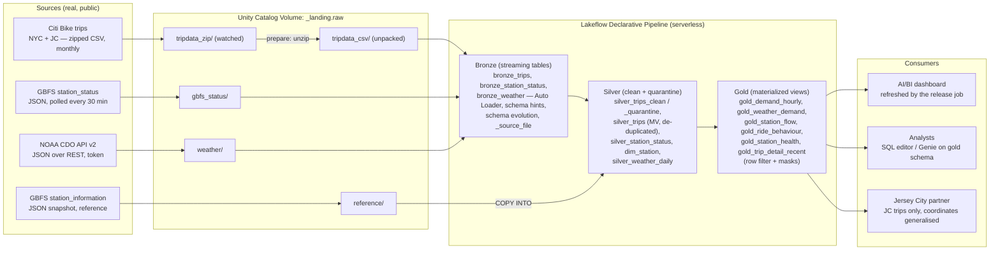

# Assignment 2C — Bike-Share Fleet Operations: Demand, Rebalancing & Station Health

Individual submission for BJIT Databricks Data Engineer Assignment 2C (Variant C).
Client (fictional): **Riverline Urban Planning**, advising a city transport department on
bike-share rebalancing and station expansion.

Status: work in progress, built incrementally Day 1 → Day 5 per the assignment's day plan.
This README is updated as each task is completed; nothing below is written ahead of being verified.

---

## 1. Project overview

Build a production-shaped Databricks lakehouse on ~55M real Citi Bike trip records (New York City +
Jersey City, May 2024 – June 2025), a live GBFS station-status feed, and NOAA daily weather, so the
client can answer: when demand peaks, which stations drain/fill, how e-bike usage is changing, how
weather affects demand, and which busy stations run empty. The platform must refresh itself as new
monthly files arrive, reconcile every file back to its source, quarantine (not silently drop) bad
records, and enforce that the Jersey City partner only sees Jersey City trips with generalised
coordinates. Everything is deployed from Git via one Databricks Asset Bundle to `dev` and `prod`.

## 2. Business problem

Citi Bike NYC set a ridership record in 2024 (44M+ rides) and its live feed reports bike/dock
availability every few minutes. Riverline's client (the city transport department) needs to know
where bikes pile up and where stations run dry, so they can plan rebalancing routes and station
expansion — but they also need to trust the numbers (every count reconciled), trust the access
model (partner data isolation, coordinate privacy), and be able to operate/deploy the platform
themselves after the engineer leaves.

## 3. Architecture

### 3.1 End-to-end lakehouse flow (assignment Section 2, "What you are building")



### 3.2 Landing simulator flow — where files actually get downloaded

Bronze never talks to S3 directly; it only watches the Unity Catalog Volume. The local relay script
(`tools/drop_files.py`, Appendix A.7) is what moves files from the public source into that Volume,
one batch at a time, to simulate a real upstream system:

```mermaid
flowchart LR
    S3["Public AWS S3 bucket\ns3.amazonaws.com/tripdata\n(no account/credentials needed)"]
    CACHE["Local cache\n.landing_cache/\n(this machine — download once)"]
    SDK["Databricks SDK upload\n(WorkspaceClient.files.upload)"]
    VOL["Unity Catalog Volume\n/Volumes/workspace/<env>_landing/raw/tripdata_zip/"]
    PREP["prepare.py (job task)\nunzip -> tripdata_csv/, register in ops.file_manifest"]
    BRZ["Bronze: bronze_trips\n(Auto Loader watches tripdata_csv/)"]

    S3 -->|"--download-only"| CACHE
    CACHE -->|"--env dev/prd --match/--batch/--interval"| SDK
    SDK --> VOL
    VOL --> PREP
    PREP --> BRZ
```



Why local, not direct-to-Bronze (decision recorded during Task 1.1 setup):
- **Simulates a real upstream system**: `--batch`/`--interval` deliver files over time so the
  file-arrival trigger, incremental Auto Loader behaviour, and per-period reconciliation are
  genuinely exercised (not a single bulk load).
- **Bronze reads CSVs, not zips**: `prepare.py` must unzip and register files in the manifest first;
  skipping that step bypasses required reconciliation bookkeeping.
- **Compute-quota conservation**: Free Edition has a daily compute quota; downloading ~10GB from a
  paid-by-the-second serverless notebook would spend quota on file transfer rather than pipeline
  work. The local relay is unmetered.
- **Explicit in the assignment**: `tools/drop_files.py` (Appendix A.7) is designed to run "on your
  laptop" — not invented for this session.

### 3.3 Unity Catalog layout (assignment Section 2)

| Schema (per target `<env>` = `dev`/`prd`) | Contents |
|---|---|
| `<env>_landing` | Volume `raw`: `tripdata_zip/`, `tripdata_csv/`, `gbfs_status/`, `reference/`, `weather/` |
| `<env>_lakehouse` | Pipeline-owned: `bronze_trips`, `bronze_station_status`, `bronze_weather`, `silver_trips_clean`/`_quarantine`, `silver_trips` (MV), `silver_station_status`, `silver_weather_daily` (MV), `dim_station` (MV), `ref_station_information` |
| `<env>_gold` | `gold_demand_hourly`, `gold_weather_demand`, `gold_station_flow`, `gold_ride_behaviour`, `gold_station_health`, `gold_trip_detail_recent` (row filter + masks) — the only schema analysts are granted |
| `<env>_ops` | `file_manifest`, `reconciliation`, `release`, `incidents`, `entitlements`; functions `rf_scope`, `mask_text`, `mask_coord`; performance-lab tables |

Nothing in deployed code is hard-coded to `dev`/`prd` — catalog and prefix come from bundle
variables, job parameters, or pipeline configuration.

## 4. Day-by-day plan

| Day | Focus | Exam sections | Key outputs |
|---|---|---|---|
| 1 | Environment, landing, COPY INTO, REST + secrets | S1 Platform, S2 Ingestion, S5 CI/CD | Smoke test ✅, bundle skeleton, first data landed |
| 2 | Declarative pipeline: Bronze, Silver, Gold | S2 Ingestion, S3 Transformation | Auto Loader, expectations, quarantine, Gold objects |
| 3 | Lakeflow Jobs and CI/CD | S4 Lakeflow Jobs, S5 CI/CD | Control-flow DAG, 3 trigger types, GitHub Actions to prod |
| 4 | Backfill, tuning, troubleshooting | S3 Transformation, S6 Troubleshooting | 50M+ rows reconciled, tuning/layout numbers, repair run |
| 5 | Governance, dashboard, client pack | S7 Governance | Grants, filters, masks, ABAC, dashboard, demo |

### Day 1 tasks
- [x] **1.1 Environment & smoke test** — done; see [Environment findings](#environment-findings-task-11).
- [x] **1.2 Repository and bundle skeleton (files)** — all starter-kit files created in this repo; `bundle validate`/`deploy`/`setup_job` still to run.
- [ ] **1.3 Land first period + COPY INTO reference data** — `drop_files.py --env dev --match 202502`, `ref_station_information`.
- [ ] **1.4 REST ingestion with secrets** — NOAA token in secret scope `a2`, `weather_rest.py`, `gbfs_poll.py`.

### Day 2 tasks
- [ ] **2.1 Bronze with Auto Loader** — `bronze_trips`, `bronze_station_status`, `bronze_weather`; schema-evolution drill.
- [ ] **2.2 Silver: conform, clean, validate, quarantine, de-duplicate** — 7 documented rules, quarantine table, dedup MV.
- [ ] **2.3 Gold objects for the business questions** — 6 Gold MVs, `CLUSTER BY`, governed object declared.

### Day 3 tasks
- [ ] **3.1 Build job: DAG, control flow, retries, alerts** — prepare → has_new → build → reconcile_each → quality_check → gate → certify/raise_incident.
- [ ] **3.2 Three kinds of trigger** — file-arrival, table-update, cron; proven in prod.
- [ ] **3.3 CI/CD** — Git folder branch/PR/conflict, bundle targets, GitHub Actions, end-to-end prod run.

### Day 4 tasks
- [ ] **4.1 Backfill full volume through prod** — remaining 13 months, >50M Silver rows.
- [ ] **4.2 Tuning experiment with real numbers** — perf lab parts 1–3, ≥7 measured rows.
- [ ] **4.3 Skew, spill and failures on purpose** — query profile before/after, repair run.
- [ ] **4.4 Layout: partitioning vs Liquid Clustering** — file/byte/pruning comparison.
- [ ] **4.5 Monitoring: run history and health** — duration trend, expectation trend, blocked-DAG view.

### Day 5 tasks
- [ ] **5.1 Access control and table lifecycle** — GRANT/REVOKE/SHOW GRANTS, DROP/UNDROP.
- [ ] **5.2 Row filter and column mask** — 3 entitlement states proven.
- [ ] **5.3 ABAC: two policies, many tables** — governed tags + schema-level policies.
- [ ] **5.4 Dashboard, business answers and lineage** — ≥4 visuals, BQ1–BQ4, lineage graph.
- [ ] **5.5 Client pack and the demo** — README, evidence pack, demo script, exam notes.

## 5. Repository layout (Appendix A.2)

```
a2c_bikeshare_ops/
├── databricks.yml                  # bundle: variables and dev / prod targets
├── resources/
│   ├── pipeline.yml                # the Lakeflow declarative pipeline
│   ├── jobs.yml                    # setup, build, release, weather_job, gbfs_job
│   └── dashboard.yml                # Day 5
├── src/
│   ├── setup/setup_objects.py      # schemas, volume, ops tables, governance functions
│   ├── ingest/load_reference.py    # COPY INTO reference data
│   ├── ingest/weather_rest.py      # REST + secrets
│   ├── ingest/gbfs_poll.py         # live GBFS feed, no key
│   ├── pipeline/bronze.py          # Auto Loader streaming tables
│   ├── pipeline/silver.py          # conform, rules, quarantine, de-duplication
│   ├── pipeline/gold.sql           # materialized views, governed objects
│   ├── jobs/prepare.py             # discover new files, expected row counts
│   ├── jobs/reconcile_period.py    # for-each body
│   ├── jobs/quality_check.py       # sets the gate task value
│   ├── jobs/certify.py, raise_incident.py
│   ├── sql/release_summary.sql, sql/pipeline_sla.sql
│   ├── governance/*.sql            # Day 5
│   ├── perf/perf_lab.py, layout_lab.sql
│   └── dashboards/client_dashboard.lvdash.json
├── tools/drop_files.py             # landing simulator (runs on the laptop)
├── tools/00_smoke_test.py          # run once in the workspace on Day 1 ✅
├── tools/drift_drill.py            # dev-only schema-drift rehearsal
├── .github/workflows/deploy.yml    # CI/CD
└── docs/  architecture.png  evidence.md  demo-script.md  exam-notes.md
```

This layout is now fully populated (all files listed above exist); the remaining Day 1 work is
`bundle validate`/`deploy -t dev` and `setup_job`, then landing the first data period.

## 6. Mandatory vs optional, limitations, risks

- **Mandatory**: all Day 1–4 tasks, plus Day 5 governance/dashboard/README/evidence/demo — this is
  the scored 100-point rubric.
- **Optional (bonus, ≤5 pts)**: Lakeflow Connect Jira connector, pytest/chispa unit tests in CI,
  SCD Type 2 station dimension — attempted only after everything else is done.
- **Free Edition limitations to record, not work around**: no Spark UI/cache/persist/Scala/R; only
  6 Spark settings changeable; no classic clusters; no external tables; DENY policies unavailable;
  no account-level APIs (PAT-based CI/CD instead of OIDC service principal); governed tags/ABAC
  fallback only if unsupported (ours are supported — confirmed in Task 1.1).
- **High risk**: bundle bootstrap ordering (triggers referencing not-yet-existing objects), the
  full 50M+ row backfill (quota risk), the schema-evolution and repair-run drills (intentional
  breakage), zero-secrets-in-Git guarantee, and the reconciliation exactness (Bronze = Silver clean
  + quarantine, per file).

---

## Environment findings (Task 1.1)

Captured by running `tools/00_smoke_test.py` as a one-off Databricks job (serverless, no cluster
config) against the target workspace on 2026-09-28, plus two supplementary one-off capability
probes for governed tags and service principals (not part of the Appendix A starter kit; deleted
after the check). Raw JSON result is reproduced verbatim below the table.

| Check | Result | Notes |
|---|---|---|
| Workspace type | Databricks Free Edition (serverless) | Host: `dbc-cb530432-dccc.cloud.databricks.com` |
| `databricks current-user me` | `fahim.faysal@bjitgroup.com` (workspace admin) | CLI configured via `databricks configure --host ...` |
| Outbound: Citi Bike trip files (S3) | Reachable (HTTP 200) | `s3.amazonaws.com/tripdata/index.html` |
| Outbound: GBFS feed | Reachable (HTTP 200) | `gbfs.citibikenyc.com/gbfs/2.3/gbfs.json` |
| Outbound: NOAA CDO API v2 | Reachable (HTTP 400) | Any HTTP response = host reachable; 400 is expected without an auth token/params |
| Outbound: NOAA Access Data Service (fallback) | Reachable (HTTP 200) | |
| Outbound: PyPI (control) | Reachable (HTTP 200) | Confirms the allow-list isn't blanket-restrictive |
| `session_user()` | `fahim.faysal@bjitgroup.com` | |
| Secret scopes visible | `[]` (none yet) | Expected — scope `a2` created in Task 1.4 |
| Row filter on a throw-away table | Works — `SET ROW FILTER ... ON (k)` returned only `[('A', 1)]` | Confirms row-filter mechanism is usable on serverless |
| Governed tag create/drop | **Works** — `CREATE GOVERNED TAG a2_smoke_tag VALUES ('x','y')` succeeded; `DROP GOVERNED TAG a2_smoke_tag` succeeded (no `IF EXISTS` clause supported on either statement — syntax-only limitation) | Confirms ABAC (Task 5.3) is implementable, not just a documented fallback |
| Service principal creation | **Works** — `databricks service-principals create --display-name ...` succeeded at workspace level | Workspace-level SP API available even without account-level console; test SP deleted after check |
| Invite a teammate | Not tested yet | Deferred to Task 5.1, where a real teammate account is needed for the 3-state entitlement proof |
| NOAA CDO token | Requested from https://www.ncei.noaa.gov/cdo-web/token | Pending arrival by e-mail; needed for Task 1.4 |

Raw smoke-test JSON (`00_smoke_test.py` run, job run id `883611601922860`, task run id `510145781597094`, result `SUCCESS`):

```json
{
  "hosts": {
    "Citi Bike trip files (S3)": "reachable (HTTP 200)",
    "GBFS feed": "reachable (HTTP 200)",
    "NOAA CDO API v2": "reachable (HTTP 400)",
    "NOAA Access Data Service (fallback)": "reachable (HTTP 200)",
    "PyPI (control: usually allowed)": "reachable (HTTP 200)"
  },
  "who_am_i": "fahim.faysal@bjitgroup.com",
  "secret_scopes": [],
  "secret_scopes_error": null,
  "row_filter": "[('A', 1)]",
  "row_filter_error": null
}
```

### What this means for the rest of the build
- No REST host used by this variant is blocked from serverless notebooks — Tasks 1.3/1.4 (COPY INTO,
  weather REST, GBFS poll) can run directly in the workspace; no laptop-side REST fallback is needed.
- Row filters and governed tags both work on this Free Edition workspace, so Day 5's ABAC policies
  (Task 5.3) can be genuinely implemented rather than falling back to per-object manual rules —
  though `IF EXISTS`/`IF NOT EXISTS` clauses are not supported on `CREATE/DROP GOVERNED TAG` and must
  be omitted.
- Service principals can be created at the workspace level without account-level console access —
  relevant to the CI/CD service-principal-vs-PAT decision in Task 3.3.

---

## Setup instructions

```bash
export PATH="$HOME/.local/bin:$PATH"        # Databricks CLI installed to ~/.local/bin
databricks configure --host https://dbc-cb530432-dccc.cloud.databricks.com
gh auth login
python3 -m venv .venv && .venv/bin/pip install requests databricks-sdk pyarrow
```

Landing the first batch of files locally (once, then the batch/interval mode simulates ongoing
delivery):

```bash
.venv/bin/python tools/drop_files.py --download-only        # cache all zips under .landing_cache/
.venv/bin/python tools/drop_files.py --env dev --match 202502
```

*(More sections — ingestion decisions, rules table, trigger table, access model, etc. — are added as
each task is completed, per the assignment's "capture evidence as you go" instruction.)*
